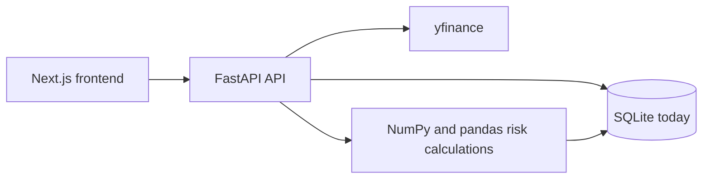
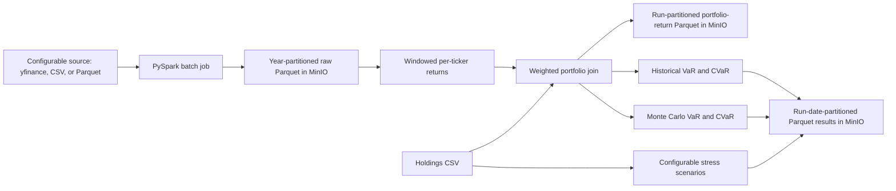
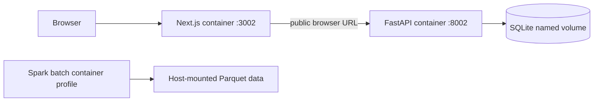
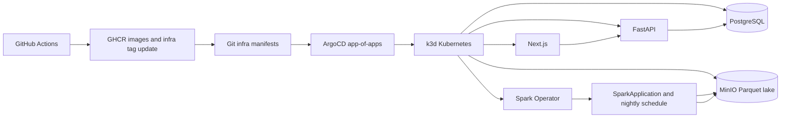

# MarketRisk Architecture

## Current application

The existing Next.js/TypeScript frontend calls a FastAPI backend. The backend uses SQLite for portfolios, holdings, watchlists, a short-lived quote cache, and risk snapshots. `yfinance` supplies current quotes and on-demand historical prices; the current API computes portfolio risk when requested.

## Phase 1: local Spark batch job

### Why these choices

- **Configurable input source:** `yfinance` is convenient for a real-data pilot, while CSV and Parquet let the same job consume another provider's historical feed without coupling the calculations to a vendor. `yfinance` should not be treated as a reliable bulk market-data service for thousands of symbols; expect rate limits and use a licensed/provider-backed export for repeatable large-universe runs.
- **Long price format:** one `(ticker, trade_date, close)` row per observation avoids wide schemas and makes ticker/date joins and partition pruning straightforward.
- **Partition raw prices by year:** date-range scans can skip unrelated years without creating a directory per ticker. The ticker window still requires Spark to redistribute and sort rows by ticker; partitioning storage and partitioning a computation solve different problems.
- **Window for returns:** `lag(close)` over each ticker ordered by date expresses the dependency on the previous observation without collecting history into a Python process.
- **Broadcast holdings:** the current input is one relatively small portfolio dimension compared with the price history. Broadcasting avoids shuffling the large price side for this join. If portfolios/holdings become large, measure and reconsider the join strategy.
- **Available-weight normalization:** on a date with missing observations, returns are reweighted across the tickers that have a valid return. This is explicit and avoids silently treating a missing daily return as zero; a stricter all-holdings calendar policy may be preferable for production valuation.
- **Approximate percentiles:** `percentile_approx` is distributed and has configurable accuracy, unlike collecting all returns to the driver for NumPy percentiles. Compare its error against the current pandas implementation on a small fixture before relying on it.
- **Monte Carlo model:** the initial batch uses a seeded normal one-day return model estimated from observed portfolio returns. It is reproducible for learning, but does not capture fat tails, volatility clustering, or cross-asset simulation beyond what is already reflected in the portfolio return series.
- **Stress inputs:** scenarios are explicit decimal returns with optional per-ticker overrides and a wildcard fallback. The included generic selloffs are illustrative, not reconstructed historical events.
- **Append-only run outputs:** daily portfolio returns are retained as an intermediate Parquet dataset partitioned by run date/run ID; risk metrics and stress results are stored separately by run date. This preserves lineage for later PostgreSQL loading and benchmarking.

## Phase 2: local containers

### Why these choices

- **Separate images:** the API image contains web/API dependencies; Java and PySpark live in the batch image. This keeps Spark's runtime out of the API container and lets Kubernetes schedule the batch workload separately.
- **SQLite named volume for this phase:** the existing API uses SQLite, so containerizing it with a persistent volume preserves its behavior and data. PostgreSQL is not silently substituted here; its migration and compatibility tests should precede the cluster phase.
- **Compose profile for Spark:** the batch process is finite and should not restart as a long-running service. An opt-in `batch` profile makes the job explicitly runnable without coupling its lifecycle to the frontend/API stack.
- **Host-mounted Parquet:** outputs survive the short-lived Spark container and can be inspected locally. MinIO/S3A support is a later object-storage integration, not simulated by a bind mount.
- **No secrets in Compose:** current local services need no external credentials. Later Kubernetes credentials will be injected from Secrets and remain outside version control.

## Target deployment (planned, not implemented yet)

### ArgoCD app-of-apps pattern

The GitOps layer should live in a separate infra repository, not in the application repo. The root application points at a folder such as `apps/`, and child applications reconcile the dev and prod overlays. This pattern creates a clean dependency order: cluster bootstrap, then shared services (MinIO/Postgres), then app workloads and batch jobs. Sync waves help keep the order explicit and avoid ArgoCD trying to deploy the Spark job before the namespace, RBAC, or storage layer exists.

### Why this is the correct structure

- **Git as the source of truth:** the cluster state mirrors the repo; drift is detected and reconciled by ArgoCD.
- **Child apps for separation of concerns:** one app can manage the shared platform stack; another can manage the application; a third can manage the nightly Spark job.
- **Image tag automation:** GitHub Actions builds and publishes immutable images to GHCR, then updates the infra repo's tag references. ArgoCD then reconciles the cluster without any `kubectl apply` from CI.
- **Rollback flow:** reverting a commit in the infra repo rolls back the declarative state, which is a core GitOps benefit.

The existing SQLite-backed API remains unchanged through the local k3d phase. Its database uses a PVC; PostgreSQL integration is still a separate, tested migration and Spark-result sink. Kubernetes Secrets hold MinIO credentials; secret values are generated locally and are not committed to Git. A dev overlay targets local k3d. A prod overlay is useful as a configuration/learning exercise, but running this full Spark/PostgreSQL/MinIO stack on production-grade managed infrastructure is not inherently free.